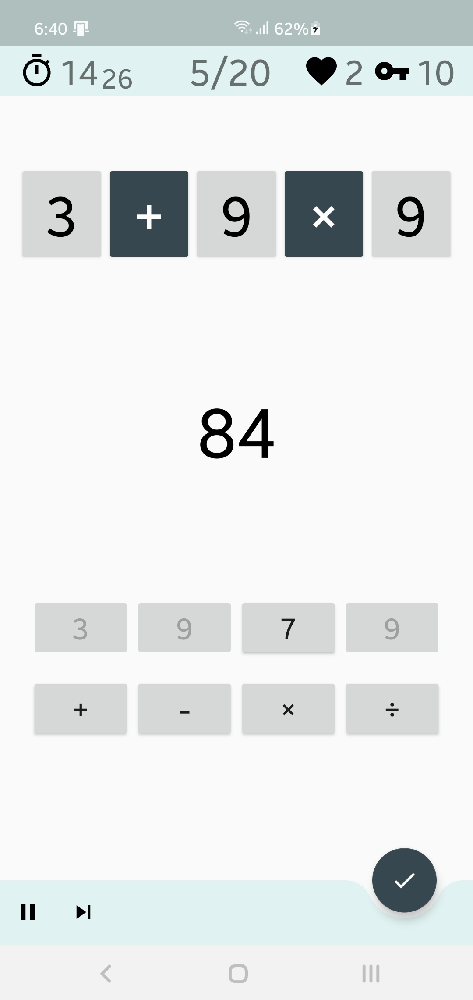
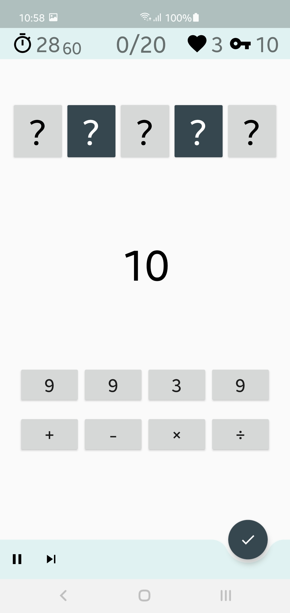
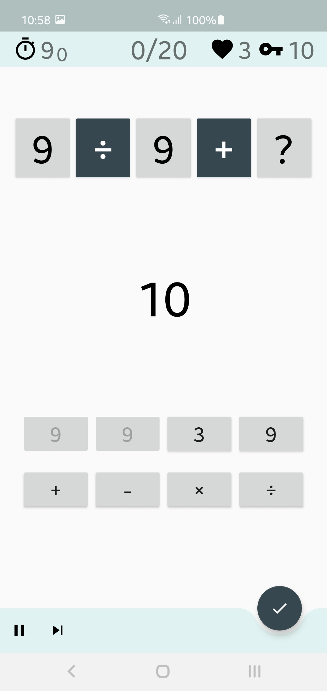
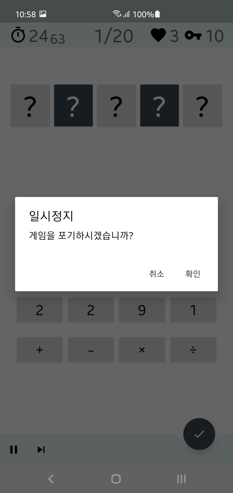
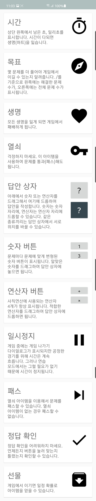
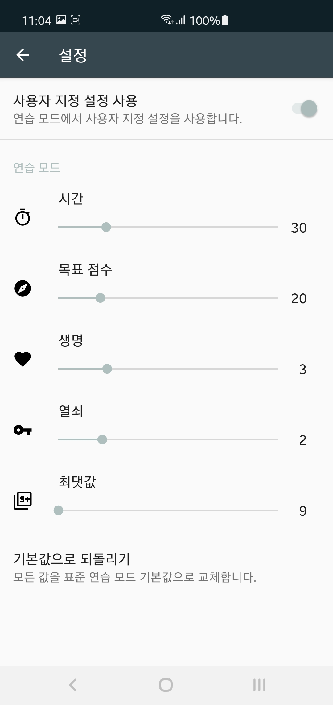

# ArithmeticOperations (사칙연산)

## 사칙연산은?
사칙연산을 이용한 발칙한 게임  
  
기존의 사칙연산 문제가 주어진 식에 맞는 답을 찾는 문제였다면  
이 게임은 주어진 답에 대한 식을 찾는 것이 목표!  
주어지는 정답에 맞는 숫자와 연산자를 드래그하여 적절한 위치에 배치하면 된다.

## 구성
### 게임 시작

목표량만큼 문제를 모두 해결해면 승리한다. 승리하면 게임에서 유용하게 사용할 수 있는 열쇠 아이템을 획득할 수 있다.  
각 문제에는 정해진 시간이 있으며 숫자와 연산자를 드래그하여 답안 상자를 채워 넣은 후 체크 버튼을 눌러 정답을 확인할 수 있다.  
제출한 답안이 틀리더라도 불이익은 없으며 시간이 남아있다면 계속 문제를 풀 수 있다.  
도저히 문제를 못 풀 것 같다면 열쇠 아이템을 사용하여 다음 문제로 넘어갈 수 있다. 문제를 해결한 것은 아니기 때문에 목표량은 증가하지 않는다.  
주어진 시간이 모두 끝난 경우 생명이 하나씩 감소하며 생명이 모두 감소할 경우 게임에서 패배하게 된다.

### 연습 모드

연습 모드에서는 시간, 목표, 생명, 열쇠, 숫자 최댓값등을 바꾸어 실험할 수 있게 구성하였다.  
처음 설정된 게임 모드가 어렵고 지루하다고 여겨진다면 연습 모드를 통해 나만의 게임 구성을 만들고 도전할 수 있다.

### 설정

연습 모드내 설정을 변경할 수 있다.  
오류 신고를 할 수 있으며 깃허브 링크로 이 페이지로 바로 방문 가능하다.  
